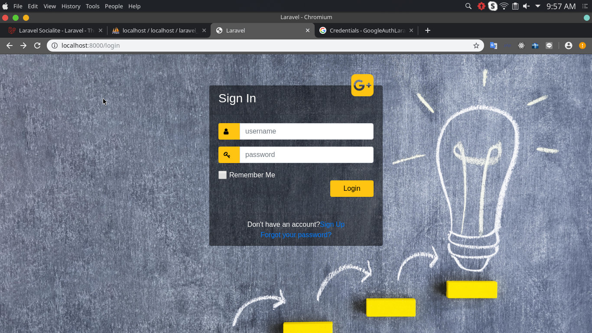
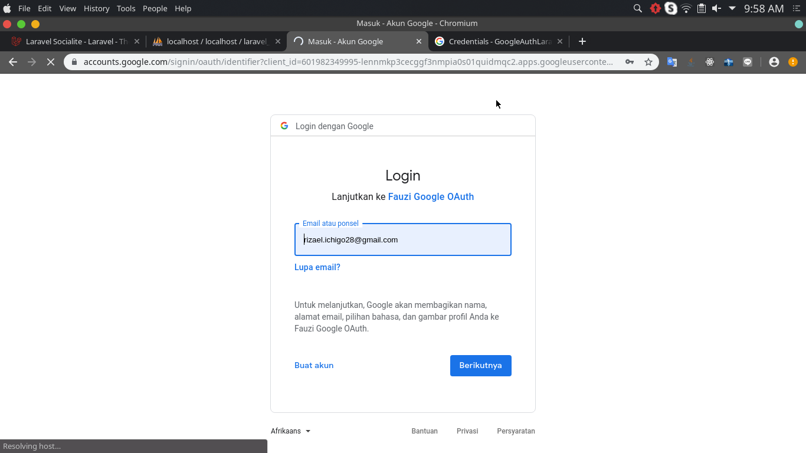
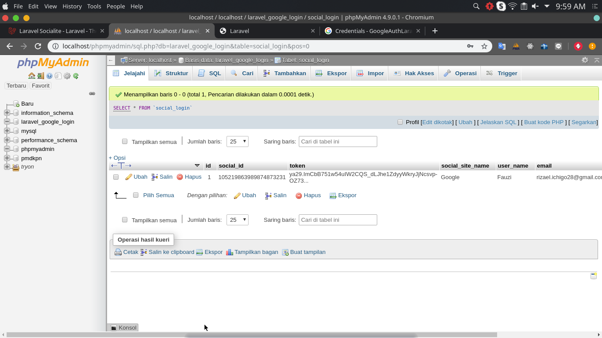

##LoginWith google with sociallite without Authuser in Laravel

##### Go to http://localhost:8000/login
Click G+ icon to login with google

##### Step 2 
Fill your google email and password

##### Step 3
Successfully login

##### Database
User data in my database

